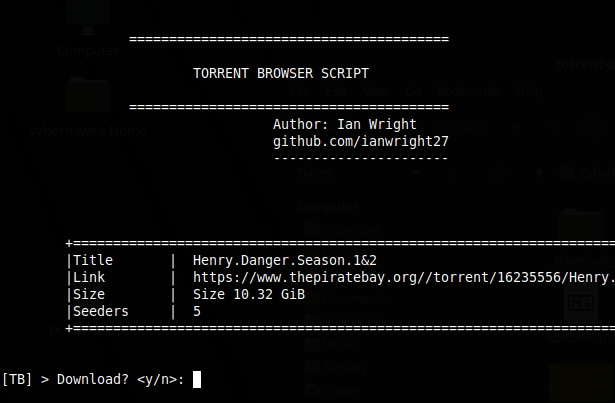

### No boring ads
# torrent-browser-terminal

A python script that browses for torrents online,
It requires two major libraries, requests and bs4.

Added functionalities include [fetching the magnet links]
Still room for perfection.
